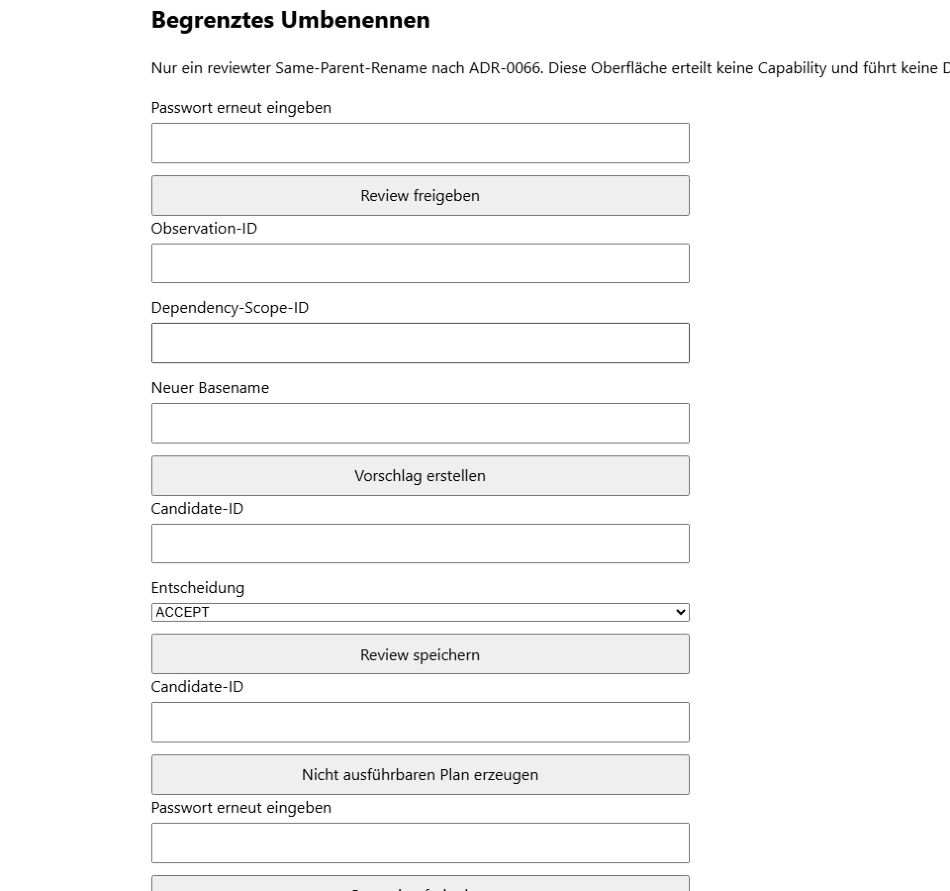

# Umfassendes Benutzerhandbuch für die E-Book-Oberfläche

Dieses Handbuch erklärt die lokale grafische FolioTone-Oberfläche. Installation,
Start, Aktualisierung und Kontoeinrichtung stehen ausschließlich in der
[Installationsanleitung](INSTALLATION.md). Terminalbefehle stehen gesammelt in
der [CLI-Referenz](CLI.md).

## Geltungsbereich

Die aktuelle Oberfläche ist `local-single-operator/v1`:

- genau ein lokales Benutzerkonto;
- Zugriff ausschließlich über die Loopback-Adresse desselben Geräts;
- `EBOOK` als einzige aktive Medienlinie;
- read-only Suche und Projektionen;
- genau ein operation-spezifischer Browserwriter: Same-Parent-`FILE_RENAME`;
- kein Remote-, LAN-, Cloud- oder Mehrbenutzerbetrieb;
- keine Browser-Controls für EPUB-Titelwrite, Quarantäne oder andere Writer.

Die Oberfläche ist noch kein vollständiger Ersatz für die CLI. Scan,
Collection-Analyse und Aufbau eines `CollectionState` werden im aktuellen Stand
im Terminal vorbereitet.

## Begriffe und IDs

Die Oberfläche verwendet opaque IDs. Sie transportieren keine fachliche
Bedeutung und dürfen nicht geraten oder aus privaten Pfaden abgeleitet werden.

| Begriff | Bedeutung | Typische Quelle |
|---|---|---|
| `ScanRoot` | dauerhaftes logisches E-Book-Quellverzeichnis | Ausgabe von `scan` oder `collection-state-build` |
| `ScanRun` | ein konkreter Scan dieses `ScanRoot` | Ausgabe von `scan` |
| `Observation-ID` | Beobachtung einer Datei in einem konkreten Scan | Such-, Analyse- oder CLI-Ausgabe |
| `CollectionRun-ID` | ein konkreter begrenzter Collection-Analyselauf | Ausgabe von `ebook-collection-analyze` oder `ebook-collection-maintain` |
| `Snapshot-ID` | unveränderlicher `CollectionState` | Ausgabe von `collection-state-build` |
| `Candidate-ID` | noch nicht kanonische, reviewbare Empfehlung | Evidence-, Review- oder Proposal-Ausgabe |
| `Plan-ID` | persistierter, zunächst nicht ausführbarer Plan | Plan- oder Rename-Ausgabe |
| `Job-ID` | dauerhafter Auftrag an einen Worker | Browserantwort und Bereich **Jobs** |
| `Authorization-ID` | kurzlebige, einmal verwendbare Operationsfreigabe | Ergebnis eines erfolgreichen Authorize-Jobs |
| `Run-ID` | persistierter Ausführungs- und Recovery-Zustand | Ergebnis eines Execute-Jobs |

Bewahre benötigte IDs zusammen mit dem zugehörigen Lauf auf. Eine ID aus einem
anderen Snapshot, Plan oder Scan ist absichtlich nicht austauschbar.

## Aufbau der Oberfläche

Nach der Anmeldung zeigt der Kopfbereich links **FolioTone** und rechts
**Abmelden**. Darunter stehen der Oberflächenstatus, die Medienlinien und die
Bereichsnavigation.

| Bereich | Zweck | Verändert Source Media? |
|---|---|---|
| **Suche** | begrenzte Abfrage eines vorhandenen `CollectionState` | nein |
| **Details** | Snapshot-, Health-, Scan-, Inventar-, Analyse-, Evidence- und Review-Projektionen | nein |
| **Umbenennen** | enger, reviewter Same-Parent-Rename mit separatem Worker | nur nach vollständiger Freigabekette |
| **Jobs** | Status dauerhafter Aufträge | nein |
| **Audit** | pfadfreie Ereignisse zu Authentisierung und Aufträgen | nein |
| **Private Locator** | kurzlebigen `PRIVATE_READ`-Grant anfordern | nein |

`MUSIC` und `IMAGE` sind bewusst sichtbar, aber als **noch nicht aktiviert**
gekennzeichnet. Sie sind keine leeren oder defekten E-Book-Ansichten.

## Anmeldung und Sitzung

Die erste Kontoeinrichtung ist in der
[Installationsanleitung](INSTALLATION.md#lokales-konto-einrichten)
beschrieben. Danach erscheint beim Aufruf der lokalen Adresse der Dialog
**Anmelden**.

Die Session liegt in einem nicht persistenten, host-only Browser-Cookie. Login,
Reauthentisierung und Privilegwechsel rotieren die Session. Inaktivitäts- und
absolute Ablaufgrenzen werden serverseitig erzwungen. **Abmelden** widerruft die
aktive Session, sofern die Seite seit dem Login nicht neu geladen wurde.

Aktuelle Oberflächengrenze: Nach einem vollständigen Neuladen der Seite kann
der Browser zwar die bestehende read-only Session wiedererkennen, besitzt aber
den nur im Arbeitsspeicher gehaltenen CSRF-Wert nicht mehr. Reauthentisierung,
schreibende Formulare und **Abmelden** können dann abgelehnt werden. Schließe in
diesem Fall die lokale Browsersitzung, öffne sie erneut und melde dich neu an.

## Standardworkflow

Der sichere Einstiegsworkflow ist im [Schnellstart](SCHNELLSTART.md) einmal
vollständig beschrieben:

```text
read-only Scan -> CollectionState -> Details/Health -> Suche -> Audit -> Abmelden
```

Für einen späteren aktualisierten Stand wiederholst du den Scan mit demselben
logischen `ScanRoot`-Namen, baust aus dem neuen abgeschlossenen `ScanRun` einen
neuen `CollectionState` und verwendest dessen neue `Snapshot-ID`. Alte
Snapshots bleiben unveränderlich und können über die CLI verglichen werden.

## Suche

Die Browser-Suche erwartet derzeit keinen freien Suchtext, sondern einen
einzeiligen `collection-query/v1`-JSON-Filter. Er wird nicht als Suchverlauf
persistiert.

### Einfache Beispiele

Alle EPUB-Dateien:

```json
{"where":{"field":"format","operator":"EQ","value":"EPUB"}}
```

Titelkandidaten mit beiden Suchwörtern:

```json
{"where":{"field":"title","operator":"MATCH","value":"Der Prozess"}}
```

Deutschsprachige PDF-Dateien, höchstens 25 Ergebnisse:

```json
{"where":{"and":[{"field":"format","operator":"EQ","value":"PDF"},{"field":"language","operator":"EQ","value":"de"}]},"limit":25}
```

### Felder und Operatoren

| Felder | Bedeutung | Erlaubte Operatoren |
|---|---|---|
| `file_id`, `observation_id` | exakte opaque Identität | `EQ` |
| `format` | `EPUB`, `MOBI`, `AZW`, `AZW3`, `PDF` oder `OTHER` | `EQ` |
| `analysis_status`, `resolution_status`, `classification_status`, `matching_status`, `review_status`, `calibre_status`, `archive_status`, `consolidation_status`, `quarantine_status` | Komponentenstatus | `EQ` |
| `finding_code` | exakter technischer Befundcode | `EQ` |
| `title`, `contributor`, `identifier`, `language`, `publisher` | lokal indexierter Metadatenkandidat | `EQ`, `PREFIX`, `MATCH` |

Gruppen verwenden `"and"` oder `"or"` mit einer Liste von Filtern. Die feste
Sortierung ist `FILE_ID_ASC`; `limit` darf 1 bis 100 betragen. Ein Filter kann
höchstens 16 Prädikate und eine Tiefe von vier Ebenen besitzen.

Suchtreffer enthalten in der normalen Ansicht keine privaten Metadatenwerte und
keine Locator. Ist der Metadatenindex für den Snapshot unvollständig, kann auch
eine formal richtige Suche weniger Treffer liefern als erwartet. **Nächste
Seite** verwendet einen an genau diese Ressource und Abfrage gebundenen Cursor.

## Details

### CollectionState und Library Health

Trage eine `Snapshot-ID` ein und wähle **CollectionState und Library Health
laden**. Der `CollectionState` bindet die persistierte Evidence eines
abgeschlossenen E-Book-Scans. Er liest beim Anzeigen keine Source Media.

`Library Health` ist mehrdimensional. Findings, Coverage, Freshness, Conflict
und Truncation müssen gemeinsam gelesen werden. Es gibt bewusst keinen
dimensionsübergreifenden Gesamtscore. Ein hoher Finding-Count ist eine
Reviewhilfe, keine automatische Lösch-, Rename- oder Metadatenentscheidung.

### Scanstatus und Inventar

Trage die opaque `ScanRoot-ID` ein und wähle **Scanstatus und Inventar laden**.
Die Ansicht fasst den neuesten gebundenen Scan und die persistierte
Inventarprojektion zusammen.

Wichtige Scanstatus:

- `COMPLETED`: der Lauf wurde vollständig beendet;
- `INTERRUPTED`: der Lauf wurde unterbrochen und kann je nach CLI-Vertrag
  fortgesetzt werden;
- `MISSING`: eine bekannte Datei wurde nicht beobachtet; dies ist keine
  physische Löschung und keine Löschfreigabe;
- `NEW`, `UNCHANGED`, `MODIFIED`, `REAPPEARED`: beobachtete Änderungen des
  Indexzustands, keine von FolioTone ausgeführten Dateioperationen.

### Analyse, Evidence und Reviews

Dieses Formular erwartet eine `CollectionRun-ID`, nicht die `ScanRun-ID`.
Wähle **Analyse, Evidence und Reviews laden**, um die gebundenen Projektionen
eines zuvor über die CLI ausgeführten Collection-Laufs zu sehen.

- **Analyse** zeigt Abdeckung und Status des Collection-Laufs.
- **Evidence** zeigt pfadfreie Candidate- und Variantenhinweise.
- **Reviews** zeigt reviewbare oder bereits entschiedene Einträge.

Candidate-Evidence ist keine kanonische Wahrheit. `ACCEPT`, `REJECT` und
`DEFER` sind bewusste Reviewentscheidungen; auch `ACCEPT` erteilt allein keine
Source-Media-Write-Authority.

### Tool- und Format-Readiness

**Readiness laden** prüft die registrierten E-Book-Spezialwerkzeuge und daraus
abgeleitete Formatbereitschaft. Typische Zustände sind:

- `READY`: die für die Projektion benötigten Werkzeuge sind verfügbar;
- `NOT_READY`: mindestens eine Voraussetzung fehlt oder ist nicht passend
  provisioniert.

Readiness öffnet keine E-Book-Datei und installiert nichts. Ein fehlendes Tool
beschädigt vorhandene Daten nicht. Nutze für Details `ebook-tools-doctor` aus
der CLI-Referenz.

### Nicht ausführbare Pläne

**Pläne laden** zeigt persistierte read-only Planprojektionen. Der Status
`NOT_EXECUTABLE` ist eine Sicherheitsgrenze: Der Plan darf nicht allein durch
die Anzeige, eine Reviewentscheidung oder einen allgemeinen Klick ausgeführt
werden.

## Jobs

**Jobs** wird nach der Anmeldung geladen. Listen mit mehr Ergebnissen bieten
**Nächste Seite** an.

| Status | Bedeutung |
|---|---|
| `WAITING` | wartet auf die passende getrennte Workerrolle |
| `ACTIVE` | wurde mit Lease und Fence beansprucht |
| `SUCCEEDED` | der gebundene Auftrag wurde erfolgreich abgeschlossen |
| `FAILED` | der Auftrag wurde ohne erfolgreichen Abschluss beendet |
| `CANCELLED` | der Auftrag wurde abgebrochen |
| `RECOVERY_REQUIRED` | der Zustand muss über den operation-spezifischen Recoveryweg geprüft werden |

Ein Job ist keine Authorization. Die Liste zeigt absichtlich keine Passwörter,
Bestätigungstexte, privaten Inputs, Locator, Capabilities oder Lease-Details.
Die aktuelle Seite aktualisiert sich nicht automatisch; lade sie kontrolliert
neu. Beachte dabei die im Abschnitt [Anmeldung und Sitzung](#anmeldung-und-sitzung)
beschriebene Reload-Grenze.

## Audit

**Audit** zeigt append-only Ereignisse unter anderem für Einrichtung,
Anmeldung, Reauthentisierung, Scopeprüfungen und Jobzustände. Audit dient der
Nachvollziehbarkeit, ersetzt aber nicht das operation-spezifische W10-Journal.

Audit enthält keine Passwörter, Bootstrap-Codes, Session- oder CSRF-Werte,
Bestätigungstexte, Pfade, Locator, Metadatenwerte, Hashes oder
Capability-Inhalte. Bewahre diese Datenschutzgrenze auch bei Screenshots und
Supportmeldungen.

## Private Locator

Das Formular **Private Locator** fordert nach erneuter Passworteingabe einen
höchstens 15 Minuten gültigen `PRIVATE_READ`-Grant an. Die Statusmeldung
**Private Locator sind für diese Session freigegeben.** bestätigt nur den
Grant.

Aktuelle Oberflächengrenze: Die Browserseite besitzt noch keine eigene
Ergebnisansicht, die diesen Grant für private Suchwerte verwendet. Private
relative Locator sind über den getrennten API-/CLI-Vertrag verfügbar; absolute
Hostpfade bleiben verboten. Für eine interaktive CLI-Suche siehe
`collection-search --private-details` in der [CLI-Referenz](CLI.md).

## Begrenztes Umbenennen

### Was dieser Ablauf darf

Der Browser adaptiert ausschließlich einen reviewten Same-Parent-`FILE_RENAME`:
Der Basename genau einer unveränderten regulären E-Book-Datei darf im selben
Ordner geändert werden. Die Bytes und der Parent-Ordner bleiben gleich. Der
Ablauf ist nur auf Linux x86_64 mit glibc und der vorgesehenen No-Replace-
Backendprüfung ausführbar.

Nicht erlaubt sind insbesondere:

- Verschieben in einen anderen Ordner oder auf ein anderes Volume;
- Überschreiben eines vorhandenen Ziels;
- Copy+Delete, allgemeine Reorganisation oder Massen-Rename;
- Löschen, Purge oder Verzeichnisbereinigung;
- Metadaten-, Sidecar- oder Calibre-Write als Teil dieses Ablaufs.

Die Oberfläche ordnet Review, Vorschlag, Plan, Authorization, Execute und
Recovery bewusst als getrennte Formulare an. Leere Felder in der folgenden
Abbildung sind beabsichtigt; die benötigten IDs dürfen ausschließlich aus dem
eigenen gebundenen Lauf übernommen werden.



*Abbildung 5: Beginn der operation-spezifischen Rename-Kette.*

### Administrative Voraussetzungen

Beginne den Ablauf nur, wenn ein vertrauenswürdiger Betreiber für exakt diesen
`ScanRoot` Folgendes bereitgestellt und geprüft hat:

- aktuelle `Observation-ID` und `Dependency-Scope-ID`;
- operation-spezifische Rename-Capability und `Capability-ID`;
- getrennten `operator-worker` mit exakt dem autorisierten Source-Mount;
- aktuelle, gesicherte Datenbank und unveränderte Source-Datei;
- Linux-No-Replace- und Capability-Probe ohne Blocker.

Die administrativen Containerbefehle stehen gesammelt unter
[Container-Overlay für den Browser-Rename](CLI.md#container-overlay-für-den-browser-rename).

Die Browseroberfläche erzeugt keine Capability und führt die physische
Dateioperation nicht im Webprozess aus. Ohne diese Voraussetzungen bleibt der
Ablauf bei einem Fehler oder einem wartenden Job stehen.

### Bedienfolge

1. Gib unter **Review freigeben** dein Passwort erneut ein. Der resultierende
   `REVIEW`-Grant ist kurzlebig.
2. Trage `Observation-ID`, `Dependency-Scope-ID` und den bereits NFC-kanonischen
   **Neuen Basename** ein. Der Basename darf keinen Pfad oder Separator
   enthalten. Wähle **Vorschlag erstellen** und sichere die ausgegebene
   `Candidate-ID`.
3. Prüfe den Candidate unabhängig. Die aktuelle Browserseite besitzt noch kein
   separates Private-Preview-Formular; verwende bei Bedarf den freigegebenen
   CLI-Befehl `ebook-rename-preview`.
4. Trage die `Candidate-ID` ein, wähle `ACCEPT`, `REJECT` oder `DEFER` und
   speichere das Review. Nur ein aktuelles `ACCEPT` kann weitergeführt werden.
5. Erzeuge mit derselben `Candidate-ID` einen **Nicht ausführbaren Plan**.
   Sichere `Plan-ID` und `Plan-Content-Hash` aus der Antwort.
6. Gib unter **Operation freigeben** dein Passwort erneut ein. Der
   `OPERATE`-Grant ist höchstens 15 Minuten gültig und ersetzt keine
   W10-Authorization.
7. Trage `Plan-ID`, `Plan-Content-Hash` und `Capability-ID` ein und lege den
   Authorize-Job an. Starte danach die passende getrennte Workerrolle. Prüfe in
   **Jobs**, dass der Auftrag `SUCCEEDED` ist, und sichere die
   `Authorization-ID`.
8. Trage für Execute dieselben gebundenen Werte und die
   `Authorization-ID` ein. Die Bestätigung muss exakt lauten:

   ```text
   CONFIRM EBOOK RENAME <Authorization-ID>
   ```

9. Lege den Execute-Job an und starte erneut den getrennten
   `operator-worker`. Prüfe Job, Folgescan, neuen `CollectionState` und
   Reconciliation. Erst der verifizierte Abschluss ist Erfolg.
10. Verwende **Recovery-Job anlegen** mit der exakten `Run-ID` nur, wenn Status
    oder Auftrag `RECOVERY_REQUIRED` melden. Rate keine ID und starte Execute
    nicht erneut.

Die rohe Bestätigung wird nach exakter Prüfung verworfen und nicht persistiert.
Authorization, Capability, Fencing, unmittelbare Verifikation, Folgescan und
Reconciliation bleiben unabhängig erforderlich.

### Interpretation der Antwort

Der Bereich unter den Rename-Formularen zeigt im aktuellen Stand eine kompakte
JSON-Antwort. Notiere nur die für den nächsten gebundenen Schritt erforderlichen
opaque IDs und Statuswerte. Teile die Antwort nicht ungeprüft, weil sie
betriebsrelevante Referenzen enthalten kann.

## Bekannte Grenzen der aktuellen Oberfläche

- Scan, Collection-Analyse und `CollectionState`-Aufbau werden über die CLI
  gestartet.
- Die Suche erwartet einen JSON-Filter statt eines einfachen Suchfelds.
- Mehrere Formulare benötigen opaque IDs aus früheren CLI- oder Browserläufen.
- Der `PRIVATE_READ`-Grant hat noch keine eigene sichtbare Browserprojektion.
- Die Rename-Private-Preview ist in der aktuellen Browserseite nicht verdrahtet.
- Abgelehnte POST-Formulare zeigen teilweise nur einen allgemeinen Fehler. Prüfe
  dann ID-Bindung, Grant-Ablauf, Jobstatus, Audit und das lokale Serverterminal,
  ohne private Werte in einen Fehlerbericht zu übernehmen.

Diese Grenzen sind Gründe für vorsichtige Bedienung und präzise
Statusinterpretation. Sie erweitern keine Source-Media-Write-Authority.

## Fehlerbehebung

### Oberfläche ist nicht erreichbar

- Prüfe nativ, ob `surface-api` noch im lokalen Terminal läuft. Prüfe beim
  Containerweg mit `docker compose ps` beziehungsweise `podman compose ps`, ob
  der Dienst läuft und gesund ist.
- Verwende exakt `http://127.0.0.1:8765/` und keinen Hostnamen, keine LAN-IP und
  keine zusätzliche Portweiterleitung.
- Prüfe den Health-Endpunkt aus der Installationsanleitung.
- Ist Port 8765 belegt, beende den kollidierenden lokalen Prozess. Das feste
  Compose-Profil veröffentlicht absichtlich nur `127.0.0.1:8765`.

### Anmeldung oder Reauthentisierung wird abgelehnt

- Prüfe Benutzername und Passwort ohne führende oder abschließende Leerzeichen.
- Warte nach wiederholten Fehlversuchen den lokalen Backoff ab.
- Beachte die Reload-Grenze und melde dich in einer neuen Browsersitzung an.
- Nutze bei verlorenem Passwort den lokalen `auth-reset`-Ablauf aus der
  Installationsanleitung.

### Details sind leer oder nicht verfügbar

- Prüfe, ob du den richtigen ID-Typ eingetragen hast.
- Baue einen `CollectionState` nur aus einem abgeschlossenen E-Book-`ScanRun`.
- Analyse-Details benötigen eine `CollectionRun-ID`, nicht die `ScanRun-ID`.
- `NOT_READY` bei optionalen Tools ist von einer fehlenden Datenprojektion zu
  unterscheiden.

### Ein Rename-Job bleibt `WAITING`

Der Browser führt den Job nicht selbst aus. Prüfe, ob der getrennte
`operator-worker` mit exakt passender Capability, Dependency Scope,
Datenbank und Source-Mount gestartet wurde. Löse den Auftrag nicht durch einen
allgemeinen schreibbaren Mount oder eine erweiterte Capability.

### Ein Job meldet `RECOVERY_REQUIRED`

Beende weitere Execute-Versuche. Sichere Datenbank und lokale Diagnose, lies den
operation-spezifischen Status mit der exakten `Run-ID` und verwende nur den
vorgesehenen Recoveryweg. Eine manuelle Dateioperation außerhalb des Vertrags
kann die persistierte Evidence unbrauchbar machen.
