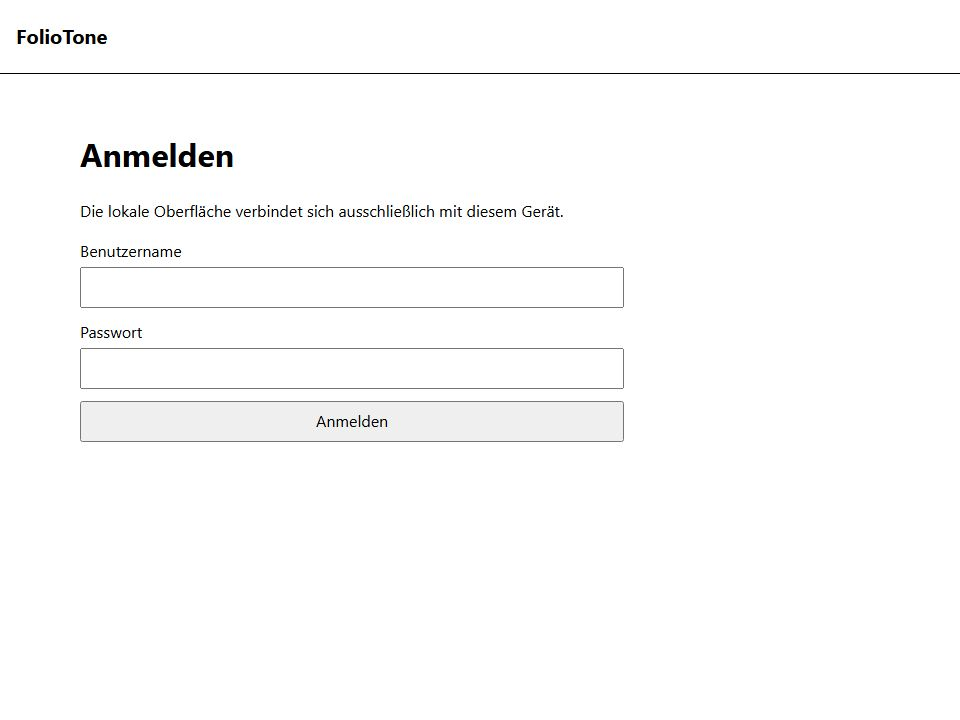

# Installation und erster Start

Diese Seite ist die gemeinsame Installationsquelle für Schnellstart,
Benutzerhandbuch und CLI-Referenz. FolioTone kann auf zwei Arten betrieben
werden:

1. als Container mit Docker Compose oder Podman Compose;
2. nativ in einer virtuellen Python-Umgebung.

Beide Varianten liefern dieselbe lokale Browseroberfläche unter
<http://127.0.0.1:8765/>. Wähle genau eine Variante für eine konkrete
Datenbank. Die Abschnitte zu Kontoeinrichtung, Sicherheit und optionalen
E-Book-Werkzeugen gelten für beide Varianten und werden deshalb nur einmal
beschrieben.

FolioTone besitzt noch keinen eigenständigen Endbenutzer-Installer und kein
veröffentlichtes Release-Paket. Die Installation erfolgt aus einem
ausdrücklich ausgewählten Stand des Quell-Repositorys.

## Gemeinsame Voraussetzungen

- ein lokales Windows- oder Linux-Benutzerkonto mit Zugriff auf ein Terminal;
- Git;
- ein aktueller Browser;
- ausreichend freier Speicher für die lokale SQLite-Datenbank und optionale
  Berichte;
- für den Containerweg Docker oder Podman, für den nativen Weg Python 3.12 in
  einer 64-Bit-Version.

FolioTone ist in diesem Profil ausschließlich für den lokalen
Einzelbenutzerbetrieb vorgesehen. Stelle den Dienst nicht über eine LAN-Adresse,
Portweiterleitung, einen Reverse Proxy oder das Internet bereit.

Zusätzliche E-Book-Werkzeuge wie calibre, Poppler, Java und EPUBCheck sind für
den ersten Start nicht erforderlich. Sie werden erst für die jeweils abhängigen
Analysen benötigt. FolioTone installiert oder aktualisiert diese Werkzeuge nicht
automatisch.

## Gemeinsame Verzeichnisplanung

Halte diese Bereiche voneinander getrennt:

| Bereich | Inhalt | Schutz |
|---|---|---|
| Programmverzeichnis | Quellcode und Compose-Dateien beziehungsweise virtuelle Python-Umgebung | normaler Benutzerzugriff |
| privates Datenverzeichnis | SQLite-Datenbank, Berichte und Arbeitsdaten | nur der lokale Besitzer |
| E-Book-Verzeichnis | die zu analysierenden Source Media | für normale Abläufe read-only |

Lege das private Datenverzeichnis nicht in einem synchronisierten, öffentlich
geteilten oder versionierten Ordner ab. Sichere die SQLite-Datenbank zusammen
mit deinen anderen privaten Anwendungsdaten. Die Datenbank darf nicht in Git
eingecheckt oder für Supportzwecke weitergegeben werden.

## Quellstand beziehen

Wechsle in das vorgesehene übergeordnete Verzeichnis und klone FolioTone:

```text
git clone https://github.com/gecompat/FolioTone.git FolioTone
cd FolioTone
```

Wenn dir ein bestimmter Commit oder Branch genannt wurde, checke exakt diesen
Stand aus. Verwende für eine bestehende produktive Datenbank keine zufällige
ältere Arbeitskopie.

## Variante A: Docker oder Podman Compose

Der Containerweg ist für die primäre Docker-/Linux-Runtime vorgesehen. Docker
und Podman verwenden dieselbe `compose.yaml`; die Befehle bleiben dennoch
getrennt angegeben, damit klar ist, welcher Provider tatsächlich ausgeführt
wird.

### A1. Provider prüfen

Für Docker:

```text
docker version
docker compose version
```

Für Podman:

```text
podman version
podman info
podman compose version
```

Unter Windows muss die gewählte Docker-Engine beziehungsweise die Podman-
Maschine bereits laufen. `podman compose` ist ein Wrapper und benötigt einen
externen Compose-Provider. Ist noch keiner installiert, richte beispielsweise
`podman-compose` in einer eigenen virtuellen Umgebung ein.

Windows PowerShell:

```powershell
py -3.12 -m venv venv\podman-compose
.\venv\podman-compose\Scripts\python.exe -m pip install "podman-compose==1.6.0"
$env:PODMAN_COMPOSE_PROVIDER = (Resolve-Path .\venv\podman-compose\Scripts\podman-compose.exe)
podman compose version
```

Linux-Shell:

```bash
python3.12 -m venv venv/podman-compose
./venv/podman-compose/bin/python -m pip install 'podman-compose==1.6.0'
export PODMAN_COMPOSE_PROVIDER="$PWD/venv/podman-compose/bin/podman-compose"
podman compose version
```

Die Umgebungsvariable gilt nur im aktuellen Terminal. Eine dauerhaft
administrierte Providerinstallation darf außerhalb der Arbeitskopie liegen.
Führe die folgenden Podman-Befehle erst aus, wenn `podman compose version`
erfolgreich ist. Offizielle Hintergründe stehen in der
[Podman-Compose-Dokumentation](https://docs.podman.io/en/latest/markdown/podman-compose.1.html)
und beim verwendeten
[`podman-compose`-Provider](https://github.com/containers/podman-compose).

### A2. Bind-Mounts konfigurieren

Kopiere die Vorlage und bearbeite ausschließlich deine lokale `.env`:

Windows PowerShell:

```powershell
Copy-Item .env.example .env
```

Linux-Shell:

```bash
cp .env.example .env
```

Setze mindestens `FOLIOTONE_DATA_DIR` und `FOLIOTONE_EBOOKS_DIR`. Bei einer
lokalen Linux-Engine sind absolute Linux-Pfade zulässig. Unter Windows hängt
die Form vom Compose-Provider ab:

- Eine Docker-CLI, die direkt mit einer WSL-Linux-Engine verbunden ist, kann
  Linux-sichtbare WSL-Pfade erwarten. Aus `C:\path\to\data` wird dann
  `/mnt/c/path/to/data`.
- Der Windows-Provider `podman-compose` 1.6.0 erwartet dagegen den
  Windows-Pfad `C:\path\to\data` und übersetzt ihn selbst. Ein bereits als
  `/mnt/c/...` angegebener Wert würde von diesem Provider ein zweites Mal
  übersetzt.
- Andere Docker-Desktop- oder Linux-Konfigurationen können abweichen. Prüfe
  den tatsächlich aktiven Provider und verwende dessen dokumentierte
  Bind-Mount-Pfadform.

Beispiel für Docker mit dem WSL-Context:

```dotenv
FOLIOTONE_DATA_DIR=/mnt/c/path/to/foliotone-data
FOLIOTONE_EBOOKS_DIR=/mnt/d/path/to/ebooks
```

Beispiel für Podman Compose unter Windows:

```dotenv
FOLIOTONE_DATA_DIR=C:\path\to\foliotone-data
FOLIOTONE_EBOOKS_DIR=D:\path\to\ebooks
```

Verwende nicht dieselbe `.env` unverändert zum Wechsel zwischen diesen beiden
Windows-Providern. Die Long-Syntax in `compose.yaml` sorgt dafür, dass auch
Pfade mit Laufwerksbuchstaben eindeutig bleiben.

Erstelle das Datenverzeichnis vorher und beschränke dessen Zugriffsrechte auf
den lokalen Besitzer. Das E-Book-Verzeichnis wird im normalen Containerprofil
read-only unter `/media/ebooks` eingebunden. `.env` ist von Git ausgeschlossen;
trage dort trotzdem keine Passwörter, Bootstrap-Codes oder Tokens ein.

### A3. Anwendungsimage bauen

Mit Docker:

```text
docker compose --profile local-surface build surface-api
```

Mit Podman:

```text
podman compose --profile local-surface build surface-api
```

Der erste Build benötigt Zugriff auf die in `Dockerfile` und `pyproject.toml`
festgelegten Images und Python-Pakete. Ein Fehler bei Registry- oder DNS-Zugriff
ist eine Host-/Netzwerkvoraussetzung und kein Anlass, den Dienst nach außen zu
öffnen.

### A4. Einmaligen Terminalcode erzeugen

Mit Docker:

```text
docker compose --profile local-surface run --rm --no-deps surface-api auth-bootstrap --database /data/foliotone.db
```

Mit Podman:

```text
podman compose --profile local-surface run --rm --no-deps surface-api auth-bootstrap --database /data/foliotone.db
```

Der Code wird genau einmal im interaktiven Terminal angezeigt, ist höchstens
15 Minuten gültig und wird bei erfolgreicher Kontoeinrichtung verbraucht.
Kopiere ihn nicht in Logs, Skripte, Environment Variables oder
Supportnachrichten.

### A5. Oberfläche starten und prüfen

Mit Docker:

```text
docker compose --profile local-surface up --detach surface-api
docker compose --profile local-surface ps
docker compose --profile local-surface logs surface-api
```

Mit Podman:

```text
podman compose --profile local-surface up --detach surface-api
podman compose --profile local-surface ps
podman compose --profile local-surface logs surface-api
```

Öffne <http://127.0.0.1:8765/>. Der technische Health-Endpunkt unter
<http://127.0.0.1:8765/api/v1/health> muss `READY` melden. Der Container hört
innerhalb seines isolierten Netzwerk-Namespace auf dem veröffentlichten Port;
Compose veröffentlicht ihn am Host fest und ausschließlich auf
`127.0.0.1:8765`. Dies ist keine Freigabe für LAN- oder Remotezugriff.

### A6. Container stoppen

Mit Docker:

```text
docker compose --profile local-surface down
```

Mit Podman:

```text
podman compose --profile local-surface down
```

Das private Datenverzeichnis bleibt auf dem Host erhalten. Verwende nicht
`down --volumes` und lösche das Datenverzeichnis nicht, wenn die Datenbank
weiter benötigt wird.

## Variante B: native Python-Installation

Der native Weg startet denselben Dienst direkt auf dem Host. Die folgenden
Beispiele setzen Python 3.12 voraus.

### B1. Virtuelle Umgebung anlegen

Windows PowerShell:

```powershell
py -3.12 -m venv .venv
Set-ExecutionPolicy -Scope Process -ExecutionPolicy Bypass
.\.venv\Scripts\Activate.ps1
python -m pip install --upgrade pip
python -m pip install .
```

Linux-Shell:

```bash
python3.12 -m venv .venv
. .venv/bin/activate
python -m pip install --upgrade pip
python -m pip install .
```

Prüfe anschließend den installierten Launcher:

```text
foliotone --version
```

Nach einem neuen Terminalstart aktivierst du die virtuelle Umgebung erneut.

### B2. Privates Datenverzeichnis anlegen

Die Beispiele verwenden das von Git ausgeschlossene Verzeichnis `runtime` in
der Arbeitskopie. Ein anderes ausschließlich lokales und geschütztes
Verzeichnis ist ebenfalls zulässig.

Windows PowerShell:

```powershell
New-Item -ItemType Directory -Force .\runtime | Out-Null
$FolioToneDatabase = (Join-Path $PWD "runtime\foliotone.db")
```

Linux-Shell:

```bash
mkdir -p runtime
chmod 700 runtime
FOLIOTONE_DATABASE_PATH="$PWD/runtime/foliotone.db"
```

Die Variablen gelten nur im aktuellen Terminal. Setze sie nach einem Neustart
erneut oder ersetze sie durch den vollständigen Pfad.

### B3. Einmaligen Terminalcode erzeugen

Windows PowerShell:

```powershell
foliotone auth-bootstrap --database $FolioToneDatabase
```

Linux-Shell:

```bash
foliotone auth-bootstrap --database "$FOLIOTONE_DATABASE_PATH"
```

Der Befehl muss interaktiv laufen. Für den Umgang mit dem ausgegebenen Code
gelten dieselben Regeln wie in Variante A.

### B4. Oberfläche starten und prüfen

Windows PowerShell:

```powershell
foliotone surface-api --database $FolioToneDatabase
```

Linux-Shell:

```bash
foliotone surface-api --database "$FOLIOTONE_DATABASE_PATH"
```

Lasse das Terminal geöffnet und rufe <http://127.0.0.1:8765/> auf. Der
Health-Endpunkt unter <http://127.0.0.1:8765/api/v1/health> muss `READY`
melden. Der native Dienst bindet ausschließlich an `127.0.0.1`; Wildcard-,
LAN- und öffentliche Adressen sind nicht zulässig. Beende ihn mit `Ctrl+C`.

## Lokales Konto einrichten

Beim ersten Browseraufruf erscheint **Lokale Einrichtung**:

1. Trage den gerade erzeugten Wert in **Terminalcode** ein.
2. Wähle einen Benutzernamen mit 3 bis 64 Zeichen. Führende oder abschließende
   Leerzeichen und Steuerzeichen sind nicht zulässig.
3. Wähle ein nur hier verwendetes Passwort mit mindestens 15 Zeichen.
4. Wähle **Einrichten**.
5. Melde dich anschließend im Dialog **Anmelden** mit Benutzername und Passwort
   an.

Nach der erfolgreichen Einrichtung erscheint die lokale Anmeldung ohne
vorbelegte Zugangsdaten:



*Abbildung 1: Lokale Anmeldung über die Loopback-Oberfläche.*

FolioTone unterstützt in diesem Profil genau ein lokales Konto. Es gibt keine
E-Mail-Recovery, Sicherheitsfragen, OAuth- oder Mehrbenutzerverwaltung.

## Start und Stopp im Alltag

Beim Containerweg verwendest du die `up`-, `ps`-, `logs`- und `down`-Befehle
aus Variante A mit genau deinem Provider. Beim nativen Weg aktivierst du die
virtuelle Umgebung, setzt den Datenbankpfad und startest `surface-api` wie in
Variante B. Öffne anschließend immer dieselbe Loopback-Adresse.

Melde dich vor dem Stopp über **Abmelden** ab, wenn die Oberfläche noch geöffnet
ist. Ein hartes Beenden löscht keine Source Media; laufende Jobs können jedoch
eine spätere Status- oder Recovery-Prüfung erfordern.

## Passwort zurücksetzen

Beende zuerst API und Worker. Führe den Reset ausschließlich in einem
interaktiven lokalen Terminal aus.

Docker:

```text
docker compose --profile local-surface run --rm --no-deps surface-api auth-reset --database /data/foliotone.db
```

Podman:

```text
podman compose --profile local-surface run --rm --no-deps surface-api auth-reset --database /data/foliotone.db
```

Native Windows-Python-Umgebung:

```powershell
foliotone auth-reset --database $FolioToneDatabase
```

Native Linux-Python-Umgebung:

```bash
foliotone auth-reset --database "$FOLIOTONE_DATABASE_PATH"
```

Gib das neue Passwort zweimal verdeckt ein. Der Reset widerruft vorhandene
Sessions und kurzlebige Grants. Benutzername und Datenbank bleiben erhalten.

## Aktualisieren

1. Beende API und Worker.
2. Sichere die private SQLite-Datenbank.
3. Wechsle auf den ausdrücklich vorgesehenen neuen Quellstand.
4. Baue beim Containerweg mit dem gewählten Compose-Provider das
   `surface-api`-Image neu. Aktiviere beim nativen Weg die virtuelle Umgebung
   und führe `python -m pip install .` erneut aus.
5. Starte FolioTone mit derselben Datenbank. Erforderliche additive Migrationen
   werden beim Start ausgeführt.
6. Prüfe Anmeldung, Übersicht und den Health-Endpunkt, bevor du weitere Jobs
   anlegst.

Ein Downgrade mit einer bereits migrierten Datenbank ist kein unterstützter
Standardweg.

## Optionale E-Book-Werkzeuge prüfen

Nativ:

```text
foliotone ebook-tools-doctor
```

Docker:

```text
docker compose --profile ebook-tools build foliotone-ebook
docker compose --profile ebook-tools run --rm --no-deps foliotone-ebook ebook-tools-doctor
```

Podman:

```text
podman compose --profile ebook-tools build foliotone-ebook
podman compose --profile ebook-tools run --rm --no-deps foliotone-ebook ebook-tools-doctor
```

`READY` bedeutet, dass alle für das jeweilige Format benötigten Werkzeuge
gefunden wurden. `NOT_READY` verhindert nicht Anmeldung, Scan oder rein
persistenzbasierte Ansichten; davon abhängige Analyseschritte bleiben jedoch
nicht verfügbar oder unvollständig. Für den kontrollierten Windows-/WSL-
Toolchain-Weg siehe die technische
[Windows-E-Book-Toolchain](../operations/WINDOWS_EBOOK_TOOLCHAIN.md).

## Nächste Schritte

- [Schnellstart für den ersten read-only Workflow](SCHNELLSTART.md)
- [Umfassendes Benutzerhandbuch](BENUTZERHANDBUCH.md)
- [CLI-Referenz](CLI.md)
