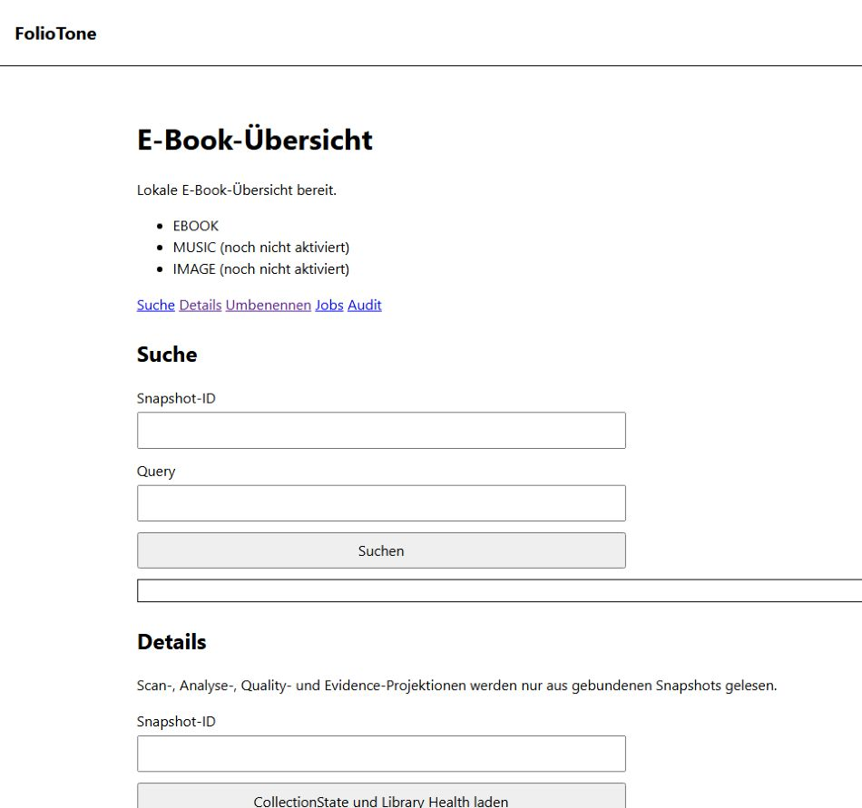
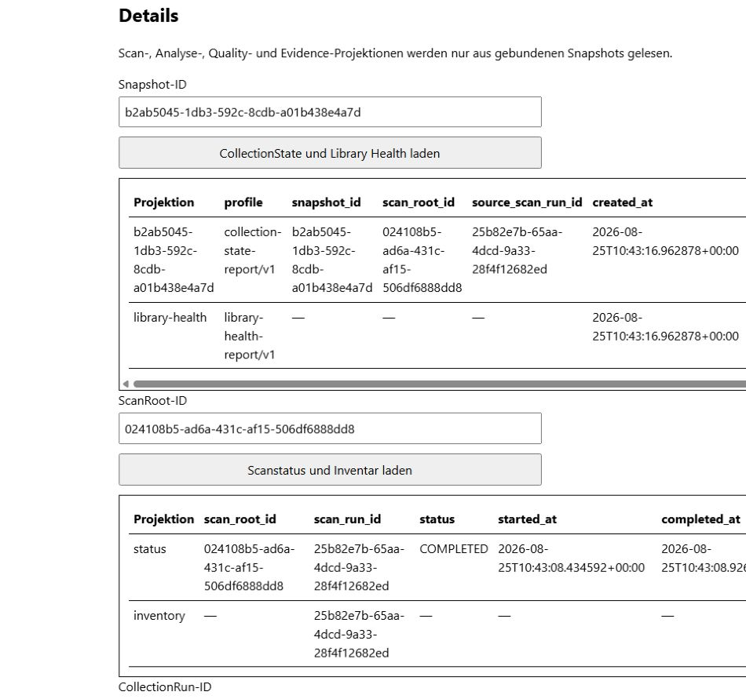
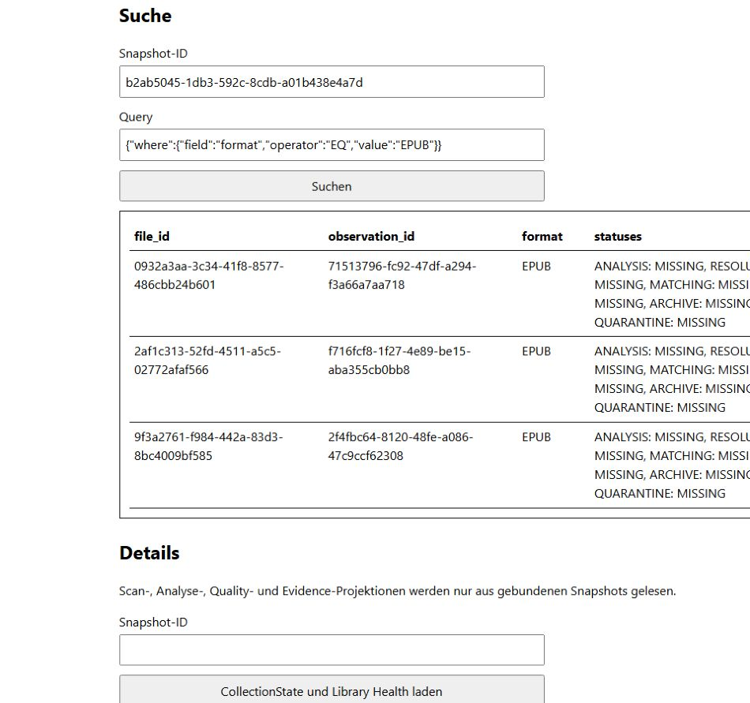

# Schnellstart: erster E-Book-Bestand in der Oberfläche

Dieser Schnellstart führt durch einen sicheren read-only Workflow: E-Books
erfassen, einen unveränderlichen `CollectionState` erzeugen und die Ergebnisse
in der grafischen Oberfläche prüfen. FolioTone verändert dabei keine
E-Book-Datei.

## Voraussetzungen

- FolioTone ist nach der [zentralen Installationsanleitung](INSTALLATION.md)
  installiert.
- Das lokale Konto ist eingerichtet.
- Der Datenbankpfad und das E-Book-Verzeichnis sind bekannt.
- Der gewählte Docker-/Podman-Provider ist bereit oder die native virtuelle
  Python-Umgebung ist aktiviert.

Verwende für einen ersten Versuch vorzugsweise einen kleinen, gesicherten
Testbestand. Private Dateinamen oder Inhalte gehören nicht in Screenshots oder
Supportberichte.

## 1. Oberfläche vorbereiten

Die aktuelle Browseroberfläche kann noch keinen Scan und keinen
`CollectionState` starten. Führe deshalb einmal den Abschnitt
[GUI-Datenbasis vorbereiten](CLI.md#gui-datenbasis-vorbereiten) der
CLI-Referenz aus.

Notiere aus der Terminalausgabe genau diese opaque IDs:

- `ScanRun` aus dem Scan;
- `Snapshot` aus `collection-state-build`;
- `ScanRoot` aus `collection-state-build`.

Eine `CollectionRun-ID` wird nur benötigt, wenn zuvor eine umfassendere
Collection-Analyse ausgeführt wurde und du deren Detailprojektionen laden
möchtest.

## 2. Anmelden und Orientierung prüfen

1. Starte `surface-api` mit Docker, Podman oder nativ wie in der
   Installationsanleitung beschrieben.
2. Öffne <http://127.0.0.1:8765/>.
3. Melde dich mit dem lokalen Benutzerkonto an.
4. Prüfe die Statusmeldung **Lokale E-Book-Übersicht bereit.**
5. Prüfe die Medienlinien: `EBOOK` ist aktiv, `MUSIC` und `IMAGE` sind als
   **noch nicht aktiviert** gekennzeichnet.

Die Bereichsnavigation führt zu **Suche**, **Details**, **Umbenennen**,
**Jobs** und **Audit**. Der Schnellstart bleibt in den read-only Bereichen.



*Abbildung 2: Startansicht der lokalen E-Book-Oberfläche.*

## 3. Snapshot und Library Health laden

1. Wechsle über **Details** zum gleichnamigen Abschnitt.
2. Trage die notierte `Snapshot`-ID in **Snapshot-ID** ein.
3. Wähle **CollectionState und Library Health laden**.

Die erste Zeile beschreibt den gebundenen `CollectionState`, die zweite die
mehrdimensionale `Library Health`-Projektion. Achte insbesondere auf:

- `item_count`: Anzahl der im Snapshot erfassten Dateien;
- `finding_count`: Anzahl der Health-Befunde;
- Coverage-, Freshness-, Conflict- und Truncation-Angaben, sofern sie in der
  Projektion vorhanden sind.

Ein Befund ist ein prüfbarer Hinweis und nicht automatisch ein Fehler oder eine
Freigabe für eine Änderung.

## 4. Scanstatus und Inventar laden

1. Trage im nächsten Formular die notierte `ScanRoot`-ID ein.
2. Wähle **Scanstatus und Inventar laden**.
3. Prüfe, ob der neueste Scan den erwarteten terminalen Status besitzt und die
   Bestandszahlen plausibel sind.

`MISSING` bedeutet nur, dass eine zuvor bekannte Datei im aktuellen
erfolgreichen Scan nicht beobachtet wurde. Es bedeutet weder, dass FolioTone
die Datei gelöscht hat, noch dass sie automatisch gelöscht werden darf.



*Abbildung 3: Gebundene Detailprojektionen mit einem abgeschlossenen Scan.*

## 5. E-Books suchen

1. Wechsle zu **Suche**.
2. Trage dieselbe `Snapshot`-ID ein.
3. Kopiere den folgenden einzeiligen Filter in **Query**, um EPUB-Dateien zu
   suchen:

   ```json
   {"where":{"field":"format","operator":"EQ","value":"EPUB"}}
   ```

4. Wähle **Suchen**.
5. Falls **Nächste Seite** erscheint, lade damit die nächste gebundene
   Ergebnisseite.

Normale Suchergebnisse bleiben bewusst pfadfrei und zeigen opaque Datei- und
Observation-IDs sowie Format- und Statusinformationen. Weitere Filterbeispiele
stehen im Abschnitt [Suche](BENUTZERHANDBUCH.md#suche).



*Abbildung 4: Drei synthetische EPUB-Treffer ohne private Locator.*

## 6. Readiness, Pläne, Jobs und Audit prüfen

1. Wähle unter **Tool- und Format-Readiness** die Aktion **Readiness laden**.
   `NOT_READY` ist zulässig, wenn optionale Spezialwerkzeuge noch nicht
   installiert sind.
2. Wähle unter **Nicht ausführbare Pläne** die Aktion **Pläne laden**. Ein
   `NOT_EXECUTABLE`-Plan ist eine persistierte Empfehlung, keine ausführbare
   Dateioperation.
3. Prüfe **Jobs**. Ein reiner Scan über die CLI erzeugt nicht zwingend einen
   Browserjob.
4. Prüfe **Audit**. Einrichtung und Anmeldung erscheinen als pfadfreie
   Auditereignisse.

## 7. Sitzung beenden

Wähle oben rechts **Abmelden**. Beende danach den lokalen Dienst nativ im
Serverterminal mit `Ctrl+C` oder mit dem `down`-Befehl deines
Compose-Providers.

Damit ist der erste Workflow abgeschlossen. Die Datenbank enthält jetzt den
Scan und einen unveränderlichen Snapshot; die Source Media wurden nicht
verändert.

## Vertiefung

- [Umfassendes Benutzerhandbuch](BENUTZERHANDBUCH.md)
- [CLI-Referenz für Analyse, Berichte und Wiederaufnahme](CLI.md)
- [Installation, Start, Update und Passwortreset](INSTALLATION.md)
